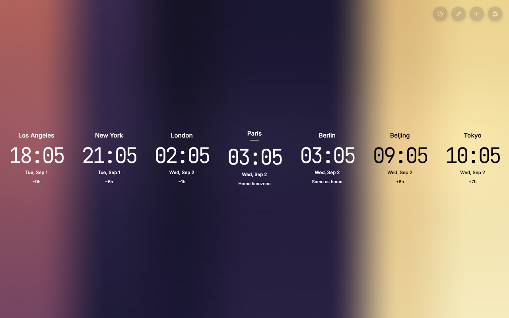

# Meridian

[](https://github.com/banastas/Meridian/actions/workflows/qa.yml)
[](https://chromewebstore.google.com/detail/meridian/jldjgjlnkhfngchiaehmmeneipcolafp)
[](LICENSE)



Meridian is a private, offline-first Chrome extension that turns every new tab into a world clock and planning surface. Its continuous gradient shows where each selected location is in its day, while time travel and shared availability make it easier to find a good moment to connect.

[Install from the Chrome Web Store](https://chromewebstore.google.com/detail/meridian/jldjgjlnkhfngchiaehmmeneipcolafp) or [explore the product page](https://banast.as/meridian/).

## Highlights

- **A living view of time:** Twelve color bands interpolate by the minute and blend across one high-resolution canvas.
- **Planning across locations:** Move every clock up to 48 hours ahead in 15-minute steps and find shared availability from configurable working or waking hours.
- **599 cities and 415 IANA time zones:** Search by localized city, country, time-zone name, or alias.
- **Flexible clock sets:** Reorder and group clocks, choose a home time zone, and save named presets for work, family, or travel.
- **Useful display controls:** Choose 12-hour or 24-hour time, optional seconds, compact density, and fixed-clock or solar-aware gradients.
- **Four localized experiences:** English, French, Spanish, and Argentine Spanish cover the interface, dates, country names, and city aliases.
- **Keyboard and accessibility support:** Add, plan, edit, and open settings without a mouse. Reduced motion, forced colors, focus states, and WCAG-aware text contrast are built in.
- **Private portability:** Keep settings local, opt into Chrome Sync, or export and import a versioned JSON backup.

## Privacy

Meridian requests one permission: `storage`. Local-only storage is the default. Optional Chrome Sync uses the browser's signed-in storage, and switching back to local-only removes Meridian's synced configuration.

The extension has no analytics, tracking, advertising, application server, location permission, or runtime network requests. Fonts, city data, translations, and time-zone coordinates are bundled with the extension.

## Install locally

1. Clone or download this repository.
2. Open `chrome://extensions` or `brave://extensions`.
3. Enable **Developer mode**.
4. Choose **Load unpacked** and select the repository root.
5. Open a new tab.

The application itself is vanilla HTML, CSS, and JavaScript. It has no runtime dependencies and no compilation or bundling step.

## Development

Node.js 20 or newer is required for tests, validation, and release packaging.

```sh
npm run check            # syntax, source, data, i18n, privacy, and regression checks
npm run data:coordinates # regenerate bundled solar coordinates from local IANA tzdata
npm run build            # rebuild dist/meridian and the current release ZIP
npm run validate:dist    # compare the package and ZIP byte-for-byte with source
npm run verify           # run the complete local release gate
```

`npm run build` removes obsolete versioned ZIPs before creating `dist/meridian-<version>.zip`. The ZIP places `manifest.json` at its root and is ready for Chrome Web Store upload. CI repeats the full release gate and fails when committed release artifacts are stale.

### Project map

| Path | Purpose |
| --- | --- |
| `newtab.html`, `newtab.css`, `newtab.js` | Extension interface and browser behavior |
| `core.js` | Deterministic time, gradient, availability, configuration, and backup logic |
| `_locales/` | Chrome i18n catalogs |
| `data/` | City catalog, localized aliases, and offline solar coordinates |
| `tests/` | Node regression suite for shared application logic |
| `scripts/` | Validation, data generation, and deterministic packaging |
| `store-assets/` | Chrome Web Store screenshot, promotional art, and editable sources |
| `docs/` | Product rationale and architecture contracts |

For implementation details, see [Architecture and feature contracts](docs/ARCHITECTURE.md). For the product rationale behind planning, privacy, and interaction choices, see the [product and experience review](docs/PRODUCT_REVIEW.md).

## Contributing and support

Bug reports and focused pull requests are welcome. Read [CONTRIBUTING.md](CONTRIBUTING.md) before opening a change. Use [GitHub Issues](https://github.com/banastas/Meridian/issues) for bugs and feature requests. Please report security concerns through the process in [SECURITY.md](SECURITY.md), not a public issue.

## Credits

Meridian was inspired by [Figure It Out](https://www.producthunt.com/products/fio-figure-it-out-for-chrome). It uses bundled [Inter](https://fonts.google.com/specimen/Inter) and [JetBrains Mono](https://fonts.google.com/specimen/JetBrains+Mono) fonts.

## License

[MIT](LICENSE)
